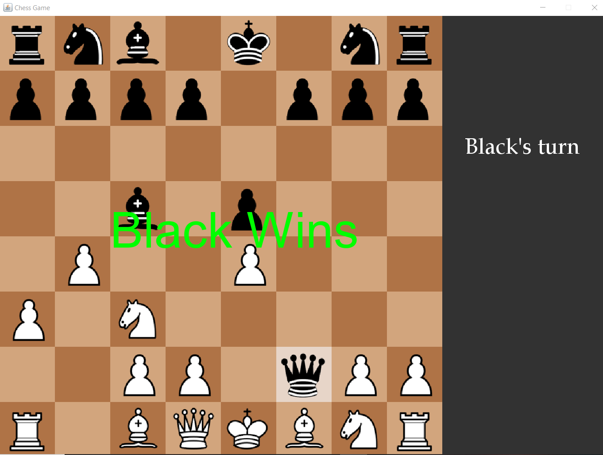

# Chess Game in Java

This is a basic chess game implementation in Java, where players can play chess against either another player. The game follows the standard rules of chess and includes features such as valid move checking, piece movements, and game state management.

## Features

- **Two-player mode**: Play with another person on the same machine.
- **Chessboard visualization**: Display a chessboard with pieces represented as characters (text-based or GUI-based).
- **Move validation**: Ensure that moves follow the rules of chess.
- **Game state tracking**: Check for check, checkmate, and stalemate conditions.

## Technologies Used

- **Java**: Core programming language used for the game logic and UI.
- **Swing**: For creating the graphical user interface (GUI) (optional, if applicable).

## Prerequisites

- **Java**: Ensure that you have JDK 8 or higher installed on your machine.

## How to Run

1. **Clone the repository**:

    ```bash
    git clone https://github.com/KamalAle12/SimpleChess.git
    cd SimpleChess
    ```

2. **Navigate to the `Main.java` file**: The main method for the game is located in the `Main.java` file.

    You can view the `Main.java` file directly here: [Main.java](https://github.com/KamalAle12/SimpleChess/blob/master/src/main/Main.java)

3. **Compile the Java files**:

    ```bash
    javac src/main/Main.java
    ```

4. **Run the game**:

    ```bash
    java -cp src/main Main
    ```

    This will start the chess game in a console window (or GUI if implemented).

## Gameplay Instructions

1. After launching the game, you will see the chessboard displayed in the terminal (or GUI window).
2. In two-player mode, one player controls the white pieces and the other controls the black pieces.
3. Players take turns moving their pieces according to the standard rules of chess.
4. To move a piece, type the move in the format of `e2 to e4` (or use a GUI to select the move).
5. The game will check if the move is valid based on the rules of chess and update the board.
6. The game ends when one player is checkmated or the game reaches a draw condition.

## Sample Output

Here is a screenshot of the game in action (text-based or GUI-based):



In the image above, you can see the chessboard with pieces at their starting positions. The game allows players to interact with the board and make moves using either text input or a graphical interface.

## Contributing

1. Fork this repository.
2. Create a new branch (`git checkout -b feature-name`).
3. Make changes and commit them (`git commit -am 'Add new feature'`).
4. Push to the branch (`git push origin feature-name`).
5. Create a new pull request.

## License

This project is licensed under the MIT License - see the [LICENSE](LICENSE) file for details.

---


